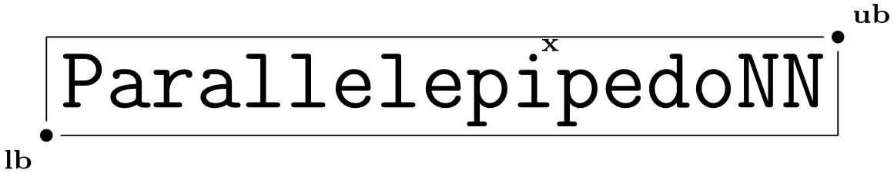
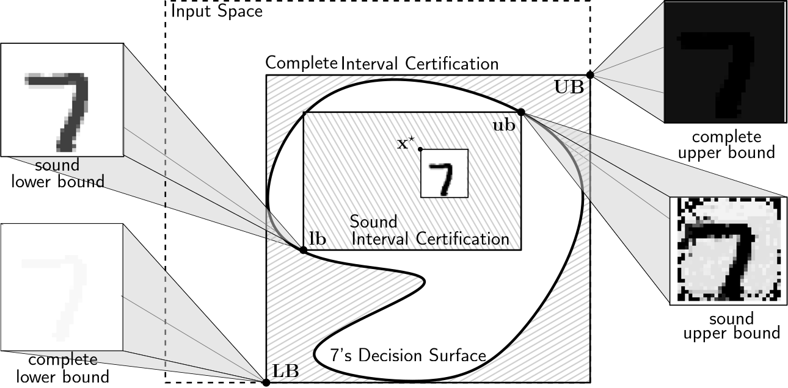
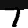
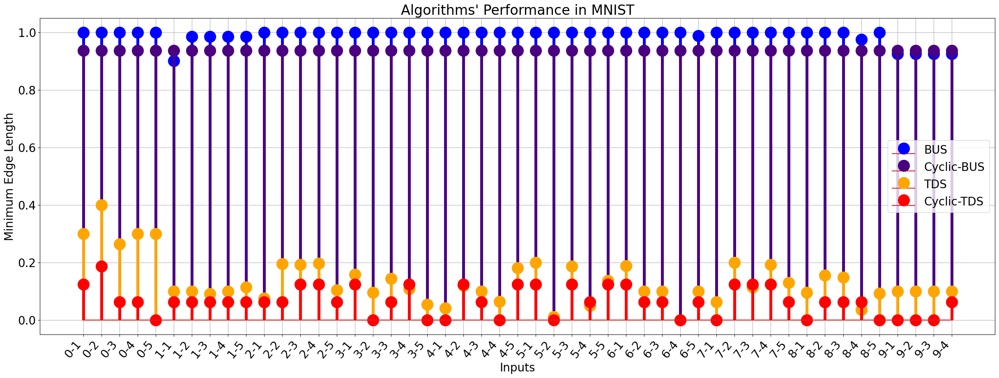
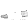
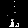
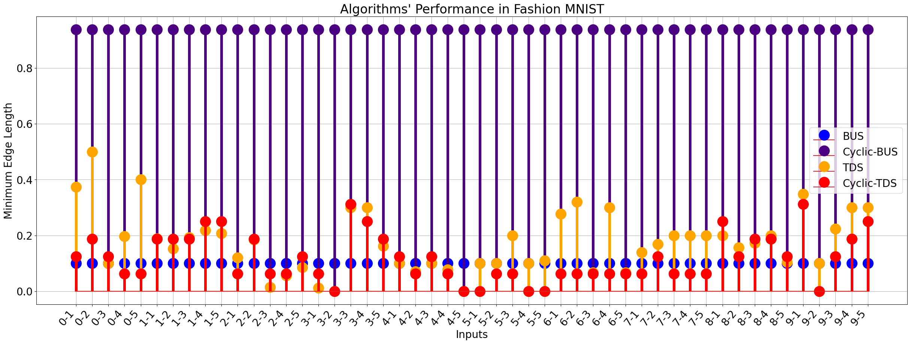

 

*Computing Maximally Sound & Minimally Complete Interval Certifications for Multilayered Perceptrons*

|                |                                                              |
| -------------- | ------------------------------------------------------------ |
| **Author:**    | Merkouris Papamichail                                        |
| **email:**     | mercoyris@ics.forth.gr                                       |
| **Institute:** | Institute of Computer Science, Foundation for Research and Technology -- Hellas,<br/>Computer Science Department, University of Crete |
| **Version:**   | 2.2.0.5                                                      |
| **Last Edit:** | 14/1/2026                                                    |
| **LICENSE**    | Creative Commons Attribution-NonCommercial-ShareAlike 4.0 International License |

----

## Description



Multilayered Perceptron (MLP) Classifiers partition the input space to *compact* decision surfaces $\mathcal{D}_c$. Even for simple MLPs these decision surfaces can be quite complex. **ParallelepipedoNN** computes *maximally sound interval*, or *minimally complete* approximations to these decision surfaces, given an input point $\mathbf{x}^\star$, that get classified in the class $c$, by a MLP classifier $\kappa(\cdot)$, i.e. $\kappa(\mathbf{x}^\star) = c$. In the $\mathbb{R}^d$ space an interval $I$ is represented by two vectors $\mathbf{lb}, \mathbf{ub}$, s.t. $\mathbf{lb} \leq \mathbf{ub}$. Here we generalize $\leq$ to denote the *coordinate-wise* less than or equal comparison. An interval $I = [\mathbf{lb}, \mathbf{ub}]$ is *sound* if $I \subseteq \mathcal{D}_c$. An interval $I$ is *maximally sound*, if it is sound, and for every $I^\prime$, s.t. $I^\prime \subseteq \mathcal{D}_c$, then $I^\prime \subseteq I$.

## Installation

Simply download and install the requirements, then download the current code from this repository. Additional information on how to install the Marabou verifier can be found [here](https://github.com/NeuralNetworkVerification/Marabou). Note that installing the 3rd party Gurobi optimizer is *optional*, and not required to recreate our experiments.

### Dependencies

| Library | Version |
| - | - |
| Python | 3.8 |
| Marabou | 2.0 |
| ONNX | 1.16.0 |
| NumPy | 1.23.5 |
| Matplotlib | 3.7.2 |
| TensorFlow | 2.12.0 |

## Usage

### Run a Single Instance

The `parallelepipedonn.py` script is located at the `./bin` directory.

* For testing if the application is installed properly, you can run the help listing: `python parallelepipedonn.py -h`

* Some example instances:

  ```bash
  python parallelepipedonn.py -x ./data/inputs/MNIST/7-1.csv -c 7 -nn ./nn_weights/mnist_nn-32.onnx -al bu-d-dfs
  ```
  
  ```bash
  python parallelepipedonn.py -x ./data/inputs/MNIST/7-1.csv -c 7 -nn ./nn_weights/mnist_nn-32.onnx -al td
  ```

### Recreate our Experiments

To recreate our experiments use the `experiments_script.py` located at the `./experiments` directory. Use the command:

```bash
python experiments_script.py "../data/inputs/MNIST" "./nn_weights/mnist_nn-32.onnx" 35 10000 60 td
```

To run the Top Down algorithm on the MNIST neural network, using 35 threads, 10,000 max. iterations, and 60 min. timeout. Alternatively, you can use the `all_algos_single_dataset.sh` to apply all the recommended algorithms on a single dataset.

### (Optional) Generate the Datasets

In order to generate the datasets, `cd` to the `./experiments` directory and use the following command:

```bash
python gen_mnist_single_class.py
```

As is the script will generate `5` instances of the `7` class. Change the variable `class_identifier` to generate instances of a different class. Change the variable `num_samples` to generate a different number of instances.

### (Optional) Retrain the Neural Networks

In order to retrain the MNIST dataset, first you need to erase (or rename) the files from the `./nn_weights` directory (without erasing the directory). Then you need to run the `test_nn.py` script, located at the `./tests` directory. For Fashion MNIST, the `test_nn.py` and the `./neural_network.py` scripts need to be modified, by un-commending some lines, and re-running `test_nn.py`.

### CLI Arguments

| Argument | Description | Example | Domain | Req. | Default |
| -------- | ----------- | ------- | ------ | ------- | -------- |
| `-x` | The path to input point x_star | `-x <x_star_path>.csv` | files | ✔ | |
| `-c` | The class c_star of the input point x_star | `-c <c_star>` | int | ✔ | |
| `-nn` | The path to the onnx representation of a NN | `-nn <onnx_description>.onnx` | ONNX file | ✔ | |
| `-lb` | The path to lower bound csv file | `-lb <lb_path>.csv` | csv file | ✘ | |
| `-ub` | The path to upper bound csv file | `-ub <lb_path>.csv` | csv file | ✘ | |
| `-od` | output sub-directory, under `/outoputs/<subdir>/out.csv` | `-od <output-subdir>` | directory (will be created if not exists) | ✘ | `algo` (see bellow)|
| `-ov` | Overwrite result-files if exist | | Boolean | ✘ | False |
| `-si` | Save ub, lb as .png images, using output_dir | | Boolean | ✘ | False |
| `-al` | The algorithm to be used | `-al <algo>` | (see supported algos bellow) | ✘ | `td`|
| `-mi` | Max. number of iterations | `-mi <max_it>` | int | ✘ | 10,000 |
| `-r` | The distance restriction radius | `-r <radius>` | float | ✘ | 1.0 |
| `-d` | The percision parameter delta | `-d <delta>` | float | ✘ | 0.1 |
| `-du` | The scalar of the domain's upper bound  | `-du <dom_ub>` | float | ✘ | 1.0 |
| `-dl` | The scalar of the domain's lower bound  | `-dl <dom_lb>` | float | ✘ | 0.0 |
| `-t` | Timeout | `-t <timeout (mins)>` | int | ✘ | 60 |
| `-v` | The verifier to be used (sound or complete) | `-v <verif>` | `mara-sound`, `mara-complete` | ✘ | `mara-sound`|
| `-no` | No output, suppress exporting computed lb, ub as csvs | | Boolean | ✘ | False |
| `-sr` | Simple results, outputing results as numbers in stdout | | Boolean | ✘ | False |
| `-q` | Quiet, supress output | | Boolean | ✘ | False |
| `-h` | Help, print help | | Witout args, or `al`: list supported algos, `pc`: list path conventions, `v`: list supported verifiers | ✘ | |

### Supported Algorithms

Bellow we list the supported algorithms. We mark as *tested* the algorithms that have been extensivly tested and evaluated. The other algorithms are in working condition, but may be *extremely* slow, even for small NN. These algorithms are listed here for completeness.

| Arguments | Description | Sound/Complete | Recommended |
| --------- | ----------- | :------------: | :----: |
| `bu-l-dfs` | Bottom-Up Linear DFS | **S** | ✘ |
| `bu-d-dfs` | Bottom-Up Dichotomic DFS | **S** | ✔ |
| `bu-bfs` | Bottom-Up BFS | **S** | ✘ |
| `td` | Top-Down | **S** | ✘ |
| `c-bu-l` | Cyclic Bottom-Up Linear | **S** | ✘ |
| `c-bu-d` | Cyclic Bottom-Up Dichotomic | **S** | ✔ |
| `c-td` | Cyclic Top-Down | **S** | ✔ |
| `td+bu-l-dfs` | Top-Down + Bottom-Up Linear DFS | **S** | ✘ |
| `td+bu-d-dfs` | Top-Down + Bottom-Up Dichotomic DFS | **S** | ✔ |
| `td+bu-bfs` | Top-Down + Bottom-Up BFS | **S** | ✘ |
| `c-bu-l+bu-l-dfs` | Cyclic Bottom-Up Linear + Bottom-Up Linear DFS | **S** | ✘ |
| `c-bu-l+bu-d-dfs` | Cyclic Bottom-Up Linear + Bottom-Up Dichotomic DFS | **S** | ✘ |
| `c-bu-l+bu-bfs` | Cyclic Bottom-Up Linear + Bottom-Up BFS | **S** | ✘ |
| `c-bu-d+bu-l-dfs` | Cyclic Bottom-Up Dichotomic + Bottom-Up Linear DFS | **S** | ✘ |
| `c-bu-d+bu-d-dfs` | Cyclic Bottom-Up Dichotomic + Bottom-Up Dichotomic DFS | **S** | ✘ |
| `c-bu-d+bu-bfs` | Cyclic Bottom-Up Dichotomic + Bottom-Up BFS | **S** | ✘ |
| `c-td+bu-l-dfs` | Cyclic Top-Down + Bottom-Up Linear DFS | **S** | ✘ |
| `c-td+bu-d-dfs` | Cyclic Top-Down + Bottom-Up Dichotomic DFS | **S** | ✘ |
| `c-td+bu-bfs` | Cyclic Top-Down + Bottom-Up BFS | **S** | ✘ |
| `complete-bu` | Complete Bottom-Up | **C** | ✔ |
| `complete-c-d-bu` | Complete Cyclic Dichotomic Bottom Up | **C** | ✔ |

**IMPORTANT:** *For the complete algorithms the argument `-v mara-complete` must be used.* Otherwise, the results will be wrong.

## Experiments

### SetUp

For our experiments we randomly choose 50 MNIST images from MNIST's Test Set, 5 from each of the 10 classes. Bellow, we list the *Hardware, Parameters*, and the *MNIST Neural Network*, we used in our examples. Note that we normalized the dataset, s.t. each image belongs to the $[0, 1]^{784}$. The NN has been trained on the normalized dataset.

#### Hardware

The system specifications bellow are recommended for *parallel* execution of multiple inputs. For testing a single input, a simple CPU with ~1GB of RAM would suffice.

| Parameters Desc. | Values |
| - | - |
| **OS**            | Ubuntu 18.04              |
| **CPU**           |  Intel Xeon E5-2640 v4    |
| **Clock Speed**   | 2.394GHz                  |
| **Num. Cores**    | 35                        |
| **RAM** | 128GB |

#### Parameters

The parameters bellow are common for each of the algorithms we test. Note that, since we use distance restriction of 1, our algorithm is essentially *not* distance restricted. Finally, observe that the *dichotomic* algorithms are not that sensitive to the rercision constant $\delta$.

| Parameter Desc.| CLI Argument | Value |
| ------------ | --------- | ----- |
| Percision constant $\delta$ | `-d` | 0.1 |
| Timeout | `-t` | 60 (min) |
| Max. Number of Iterations| `-mi` | 10,000 |
| Domain lower bound | `-dl` | 0.0 |
| Domain upper bound | `-du` | 1.0 |
| Distance restriction | `-r` | 1.0 |

Dichotomic algorithms are *less* sensitive to the $\delta$ value.

#### Neural Networks

The Neural Networks we used is described bellow. For both datasets, we use the same architecture.

| Parameters Desc. | Values |
| - | - |
| **Datasets**      | MNIST, Fashion MNIST      |
| **Opt. Algo.**    | Adam                      |
| **Weight Init.**  | Glorot & Bengio (2010)    |
| **In. Dim.**      | 784                       |
| **ReLU Layer**    | 32                        |
| **Linear Layer**  | 10                        |
| **Out. Dim.**     | 10                        |
| **# Trainable Parameters** | 25,450 |
| **Accuracy**      | **MNIST:** 94% **Fashion MNIST:** 82% |

### Results

#### MNIST

##### CPU Time

| Algorithm | Min. Value | Average | Max. Value | Std Dev. | Timeouts |
| --------- | :--------: | :-----: | :--------: | :------: | :------: |
| BU Dich. | 11.27 (min) | 32.78 (min) | 67.95 (min) | 18.02 (min) | 13 |
|Top Down | 8.97 (min) | 51.13 (min) | 62.54 (min) | 14.64 (min) | 28 |
| TD + BU Dich. | +4.04 (min) | +42.036 (min) | +65.72 (min) | 21.77 (min) | 25 |
| Cyclic BU Dich. | 1.05 (sec) |21.06 (sec) | 149.26 (sec) | 27.28 (sec) | 0 |
| Comp. BU | 30.29 (min) | 38.54 (min) | 49.70 (min) | 5.78 (min) | 0 |
| Comp. Cyclic BU Dich. | 2.82 (sec) | 3.92 (sec) | 4.83 (sec) | 0.55 (sec) | 0 |

##### Verification Oracle Calls

| Algorithm | Min. Value | Average | Max. Value | Std Dev. | Avg. Time/Call | Verification/Overal Time Ratio (%) |
| --------- | :--------: | :-----: | :--------: | :------: | :------: | :--: |
| BU Dich. | 1272 | 2963.86 | 3261 | 55.28 | 0.64 (sec) | 96% |
|Top Down | 1711 | 3753.02 | 4862 | 708.15 | 0.78 (sec) | 95% |
| TD + BU Dich. | +10 | +1030.55 | +2569 | +927.37 | 2.41 (sec) | 98% |
| Cyclic BU Dich. | 4 | 4 | 4 | 0 | 5.23 (sec) | 99% |
| Comp. BU | 1794 | 2085.73 | 2529 | 172.39 | 1.06 (sec) | 96% |
| Comp. Cyclic BU Dich. | 4 | 4 | 4 | 0 | 0.94 (sec) | 96% |

##### Minimum Edge Length

| Algorithm | Min. Value | Average | Max. Value | Std Dev. | # Non-Trivials |
| --------- | :--------: | :-----: | :--------: | :------: | :------: |
| BU Dich. | 0 | 0 | 0 | 0 | 0 |
|Top Down | 0 | 0.13 | 0.4 | 0.08 | 48 |
| TD + BU Dich. | 0 | 0.13 | 0.4 | 0.08 | 48 |
| Cyclic BU Dich. | 0 | 0.07 | 0.19 | 0.05 | 36 |
| Comp. BU | 0.9 | 0.99 | 1.0 | 0.02 | 11 |
| Comp. Cyclic BU Dich. | 0.94 | 0.94 | 0.94 | 0 | 49 |

##### Examples

Original Image: 

| Algorithms |                         BU Dich.                         |                   Top Down                   |                        TD + BU Dich.                         |                   Cyclic BU Dich.                    |                           Comp. BU                           |                     Comp. Cyc. BU Dich.                      |
| ---------- | :------------------------------------------------------: | :------------------------------------------: | :----------------------------------------------------------: | :--------------------------------------------------: | :----------------------------------------------------------: | :----------------------------------------------------------: |
| **LB**     |  |  |  |  |  |  |
| **UB**     |  |  |  |  |  |  |

##### Mininmum Edge Length Distribution



#### Fashion MNIST

##### CPU Time

| Algorithm             | Min. Value  |   Average    |  Max. Value  |  Std Dev.   | Timeouts |
| --------------------- | :---------: | :----------: | :----------: | :---------: | :------: |
| BU Dich.              | 10.38 (min) | 22.82 (min)  | 60.03 (min)  | 13.27 (min) |    1     |
| Top Down              | 13.48 (min) | 50.17 (min)  | 61.15 (min)  | 15.31 (min) |    32    |
| TD + BU Dich.         | +6.52 (min) | +23.91 (min) | +60.01 (min) |  13 (min)   |    1     |
| Cyclic BU Dich.       | 0.76 (sec)  |  5.15 (sec)  | 28.48 (sec)  |  6.1 (sec)  |    0     |
| Comp. BU              | 17.1 (min)  | 23.82 (min)  | 30.87 (min)  | 3.45 (min)  |    0     |
| Comp. Cyclic BU Dich. | 2.42 (sec)  |  3.52 (sec)  |  4.47 (sec)  | 0.63 (sec)  |    0     |

##### Verification Oracle Calls

| Algorithm             | Min. Value | Average  | Max. Value | Std Dev. | Avg. Time/Call | Verification/Overal Time Ratio (%) |
| --------------------- | :--------: | :------: | :--------: | :------: | :------------: | :--------------------------------: |
| BU Dich.              |    1450    | 3469.48  |    4040    |  390.51  |   0.36 (sec)   |                92%                 |
| Top Down              |    1343    | 3272.76  |    5062    |  724.22  |   0.88 (sec)   |                96%                 |
| TD + BU Dich.         |    +819    | +1779.34 |   +2757    |  386.36  |   0.77 (sec)   |                96%                 |
| Cyclic BU Dich.       |     4      |    4     |     4      |    0     |   1.26 (sec)   |                98%                 |
| Comp. BU              |   987.12   | 1375.41  |  1782.78   |  200.99  |   1.11 (sec)   |                96%                 |
| Comp. Cyclic BU Dich. |     4      |    4     |     4      |    0     |   0.85 (sec)   |                96%                 |

##### Minimum Edge Length

| Algorithm             | Min. Value | Average | Max. Value | Std Dev. | # Non-Trivials |
| --------------------- | :--------: | :-----: | :--------: | :------: | :------------: |
| BU Dich.              |     0      |    0    |     0      |    0     |       0        |
| Top Down              |     0      |  0.18   |    0.5     |   0.11   |       48       |
| TD + BU Dich.         |     0      |  0.18   |    0.5     |   0.11   |       48       |
| Cyclic BU Dich.       |     0      |  0.12   |    0.31    |   0.08   |       44       |
| Comp. BU              |    0.1     |   0.1   |    0.1     |    0     |       50       |
| Comp. Cyclic BU Dich. |    0.94    |  0.94   |    0.94    |    0     |       50       |

##### Examples

Original Image: 

| Algorithms |                           BU Dich.                           |                      Top Down                       |                        TD + BU Dich.                         |                       Cyclic BU Dich.                       |                           Comp. BU                           |                     Comp. Cyc. BU Dich.                      |
| ---------- | :----------------------------------------------------------: | :-------------------------------------------------: | :----------------------------------------------------------: | :---------------------------------------------------------: | :----------------------------------------------------------: | :----------------------------------------------------------: |
| **LB**     |  |  |  |  |  |  |
| **UB**     |  |  |  |  |  |  |

##### Mininmum Edge Length Distribution



## Application Version Log

### Version Convention

The version numbering follow the convention `X.Y.Z.W`:

* `X`: Major Theoretical Change. This change should engulf a major expansion to the underlying *mathematical theory*. 
* `Y`: Minor Theoretical Change. This change *expand the existing underlying mathematical theory*. For instance adding more algorithms that share the same underlying structure with the existing ones.
* `Z`: Major Technical Change. This change should *radically enchance the application's performance*, or other technical characteristics. 
* `W`: Minor Technical Change. This change adds minor functionality or *quality of life improvements*.

### Version Log


| Vertsion | Date  | Description |
| -------- | ----- | ------------|
| **1.0.0.0**  | **6/5/2025**  | The first edition. |
| **1.1.0.2**  | **10/6/2025** | `Y+1`: Supporting algorithms for cyclic guarantees. |
| | | `W+1`: Addind the `-lb`, `-ub` functionality for properly supporting redirection. |
| | | `W+1`: Changing the behavior of `-o` argument to give the output_dir value. Fixing the `-o` functionality to create the directory hierarchy. |
| **2.1.0.3**  | **29/9/2025** | `X+1`: Supporting complete parallelepipedal bottom up algorithm. |
| | | `W+1`: Supporting choice on the verifier from command line argument |
| **2.2.0.5**| **14/1/2026** | `Y+1`: Supporting complete cyclic dichotomic bottom up algorithm. |
| | | `W+1`: Supporting timeout, i.e. `-t` argument. |
| | | `W+1`: Supporting parallel execution of experiments, on pre-existing intervals. Used in algorithm composition. |

## LICENSE

This work is licensed under a
[Creative Commons Attribution-NonCommercial-ShareAlike 4.0 International License][cc-by-nc-sa].

[![CC BY-NC-SA 4.0][cc-by-nc-sa-image]][cc-by-nc-sa]

[cc-by-nc-sa]: http://creativecommons.org/licenses/by-nc-sa/4.0/
[cc-by-nc-sa-image]: https://licensebuttons.net/l/by-nc-sa/4.0/88x31.png
[cc-by-nc-sa-shield]: https://img.shields.io/badge/License-CC%20BY--NC--SA%204.0-lightgrey.svg