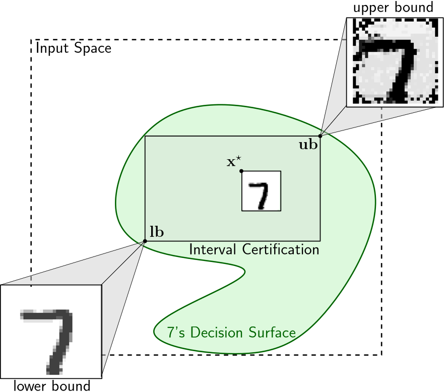

 

*Computing Maximally Sound & Minimally Complete Interval Certifications for Multilayered Perceptrons*

|                |                                                              |
| -------------- | ------------------------------------------------------------ |
| **Author:**    | Merkouris Papamichail                                        |
| **email:**     | mercoyris@ics.forth.gr                                       |
| **Institute:** | Institute of Computer Science, Foundation for Research and Technology -- Hellas, Computer Science Department, University of Crete |
| **Version:**   | 2.2.0.5                                                      |
| **Last Edit:** | 14/1/2026                                                    |

----

## Description

Multilayered Perceptron (MLP) Classifiers partition the input space to *compact* decision surfaces $\mathcal{D}_c$. Even for simple MLPs these decision surfaces can be quite complex. **ParallelepipedoNN** computes *maximal sound interval* approximations to these decision surfaces, given an input point $\mathbf{x}^\star$, that get classified in the class $c$, by a MLP classifier $\kappa(\cdot)$, i.e. $\kappa(\mathbf{x}^\star) = c$. In the $\mathbb{R}^d$ space an interval $I$ is represented by two vectors $\mathbf{lb}, \mathbf{ub}$, s.t. $\mathbf{lb} \leq \mathbf{ub}$. Here we generalize $\leq$ to denote the *coordinate-wise* less than or equal comparison. An interval $I = [\mathbf{lb}, \mathbf{ub}]$ is *sound* if $I \subseteq \mathcal{D}_c$. An interval $I$ is *maximally sound*, if it is sound, and for every $I^\prime$, s.t. $I^\prime \subseteq \mathcal{D}_c$, then $I^\prime \subseteq I$.

## Installation

### Dependencies

| Library | Version |
| - | - |
| Python | 3.8 |
| Marabou | 2.0 |
| ONNX | 1.16.0 |
| NumPy | 1.23.5 |
| Matplotlib | 3.7.2 |
| TensorFlow | 2.12.0 |

## Usage

## Experiments

### SetUp

#### Hardware

| Parameters Desc. | Values |
| - | - |
| **OS**            | Ubuntu 18.04              |
| **CPU**           |  Intel Xeon E5-2640 v4    |
| **Clock Speed**   | 2.394GHz                  |
| **Num. Cores**    | 35                        |

#### Parameters

| Parameter Desc.| CLI Argument | Value |
| ------------ | --------- | ----- |
| Percision constant $\delta$ | `-d` | 0.1 |
| Timeout | `-t` | 60 |
| Max. Number of Iterations| `-mi` | 10,000 |
| Domain lower bound | `-dl` | 0.0 |
| Domain upper bound | `-du` | 1.0 |
| Distance restriction | `-r` | 1.0 |

#### Neural Network

| Parameters Desc. | Values |
| - | - |
| **Dataset**       | MNIST                     |
| **Opt. Algo.**    | Adam                      |
| **Weight Init.**  | Glorot & Bengio (2010)    |
| **In. Dim.**      | 784                       |
| **ReLU Layer**    | 32                        |
| **Linear Layer**  | 10                        |
| **Out. Dim.**     | 10                        |
| **Accuracy**      | 94%                       |

### Results

#### CPU Time

| Algorithm | Min. Value | Average | Max. Value | Std Dev. | Timeouts |
| --------- | ---------- | ------- | ---------- | -------- | -------- |
| BU Dich. |
|Top Down | 8.97 (min) | 51.13 (min) | 62.54 (min) | 14.64 (min) | 28 |
| TD + BU Dich. | +4.04 (min) | +42.036 (min) | +65.72 (min) | 21.77 (min) | 25 |
| Cyclic BU Dich. | 1.05 (sec) |21.06 (sec) | 149.26 (sec) | 27.28 (sec) | 0 |
| Comp. BU Dich. | 30.29 (min) | 38.54 (min) | 49.70 (min) | 5.78 (min) | 0 |
| Comp. Cyclic BU Dich. | 2.82 (sec) | 3.92 (sec) | 4.83 (sec) | 0.55 (sec) | 0 |

#### Verification Oracle Calls

| Algorithm | Min. Value | Average | Max. Value | Std Dev. | Avg. Time/Call | Verification/Overal Time Ratio (%) |
| --------- | ---------- | ------- | ---------- | -------- | -------- | ---- |
| BU Dich. |
|Top Down | 1711 | 3753.02 | 4862 | 708.15 | 0.78 (sec) | 95% |
| TD + BU Dich. | +10 | +1030.55 | +2569 | +927.37 | 2.41 (sec) | 98% |
| Cyclic BU Dich. | 4 | 4 | 4 | 0 | 5.23 (sec) | 99% |
| Comp. BU Dich. | 1794 | 2085.73 | 2529 | 172.39 | 1.06 (sec) | 96% |
| Comp. Cyclic BU Dich. | 4 | 4 | 4 | 0 | 0.94 (sec) | 96% |

#### Minimum Edge Length

| Algorithm | Min. Value | Average | Max. Value | Std Dev. |
| --------- | ---------- | ------- | ---------- | -------- |
| BU Dich. |
|Top Down | 0 | 0.13 | 0.4 | 0.08 |
| TD + BU Dich. | 0 | 0.13 | 0.4 | 0.08 |
| Cyclic BU Dich. | 0 | 0.07 | 0.19 | 0.05 |
| Comp. BU Dich. | 0.9 | 0.99 | 1.0 | 0.02 |
| Comp. Cyclic BU Dich. | 0.94 | 0.94 | 0.94 | 0 |

## Application Version Log

### Version Convention

The version numbering follow the convension `X.Y.Z.W`:

* `X`: Major Theoretical Change. This change should engulf a major expansion to the underlying *mathematical theory*. 
* `Y`: Minor Theoretical Change. This change *expand the existing underlying mathematical theory*. For instance adding more algorithms that share the same underlying structure with the existing ones.
* `Z`: Major Technical Change. This change should *radically enchance the application's performance*, or other technical characteristics. 
* `W`: Minor Technical Change. This change adds minor functionality or *quality of life improvements*.

### Version Log

| Vertsion | Date  | Description |
| -------- | ----- | ------------|
| **1.0.0.0**  | **6/5/2025**  | The first edition. |
| **1.1.0.2**  | **10/6/2025** | `Y+1`: Supporting algorithms for cyclic guarantees. |
| | | `W+1`: Addind the `-lb`, `-ub` functionality for properly supporting redirection. |
| | | `W+1`: Changing the behavior of `-o` argument to give the output_dir value. Fixing the `-o` functionality to create the directory hierarchy. |
| **2.1.0.3**  | **29/9/2025** | `X+1`: Supporting complete parallelepipedal bottom up algorithm. |
| | | `W+1`: Supporting choice on the verifier from command line argument |
| **2.2.0.5**| **14/1/2026** | `Y+1`: Supporting complete cyclic dichotomic bottom up algorithm. |
| | | `W+1`: Supporting timeout, i.e. `-t` argument. |
| | | `W+1`: Supporting parallel execution of experiments, on pre-existing intervals. Used in algorithm composition. |

## LICENSE

This work is licensed under a
[Creative Commons Attribution-NonCommercial-ShareAlike 4.0 International License][cc-by-nc-sa].

[![CC BY-NC-SA 4.0][cc-by-nc-sa-image]][cc-by-nc-sa]

[cc-by-nc-sa]: http://creativecommons.org/licenses/by-nc-sa/4.0/
[cc-by-nc-sa-image]: https://licensebuttons.net/l/by-nc-sa/4.0/88x31.png
[cc-by-nc-sa-shield]: https://img.shields.io/badge/License-CC%20BY--NC--SA%204.0-lightgrey.svg