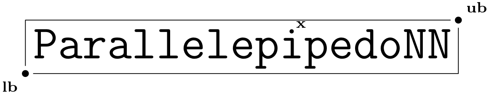

 

*Computing Trustworthy Robustness Certifications for Neural Networks*

|                |                                                              |
| -------------- | ------------------------------------------------------------ |
| **Author:**    | Merkouris Papamichail                                        |
| **email:**     | mercoyris@ics.forth.gr                                       |
| **Institute:** | Institute of Computer Science, Foundation for Research and Technology -- Hellas,<br/>Computer Science Department, University of Crete |
| **Version:**   | 2.2.3.10                                                     |
| **Last Edit:** | 13/6/2026                                                    |
| **Manual:**    | https://merkouris148.github.io/parallelepipedonn-manual/index.html |
| **LICENSE**    | Creative Commons Attribution-NonCommercial-ShareAlike 4.0 International License |
| **Pre-print:** | https://arxiv.org/abs/2606.23858                             |

------

## Installation

### Installation via Conda (Recommended)

Clone the github repository, using `git clone <repo-url>`. Then `cd` to the parallelepipedonn directory. Finally, create a dedicated [conda](https://docs.conda.io/projects/conda/en/stable/user-guide/getting-started.html) environment using the following command:

```bash
conda env create -n pnn-env -f environment.yml
```

### Manual Installation

Simply download and install the requirements, then download the current code from this repository. Additional information on how to install the Marabou verifier can be found [here](https://github.com/NeuralNetworkVerification/Marabou). Note that installing the 3rd party Gurobi optimizer is *optional*, and not required to recreate our experiments.

### Dependencies

| Library | Version | Command |
| - | - | - |
| Python | 3.8 | `conda create -n pnn-env python=3.8` |
| | | `conda activate pnn-env` |
| NumPy | 1.23.5 | `conda install numpy` |
| Matplotlib | 3.7.2 | `conda install matplotlib` |
| TensorFlow | 2.12.0 | `conda install tensorflow` |
| ONNX | 1.16.0 | `conda install onnx` |
| Marabou | 2.0 | `pip install maraboupy` |
| ONNX runtime | 1.19.2 | `pip install onnxruntime` |
| TF2ONNX | 1.16.1 | `pip install tf2onnx` |

## Usage

### Run a Single Instance

The `parallelepipedonn.py` script is located at the `./bin` directory.

* For testing if the application is installed properly, you can run the help listing: `python parallelepipedonn.py -h`

* Some example instances:

  ```bash
  python parallelepipedonn.py -x ./data/inputs/MNIST/7-1.csv -c 7 -nn ./nn_weights/mnist_nn-32.onnx -al bu-d-dfs
  ```
  
  ```bash
  python parallelepipedonn.py -x ./data/inputs/MNIST/7-1.csv -c 7 -nn ./nn_weights/mnist_nn-32.onnx -al td
  ```

### Recreate our Experiments

To recreate our experiments use the `experiments_script.py` located at the `./experiments` directory. Use the command:

```bash
python experiments_script.py "../data/inputs/MNIST" "./nn_weights/mnist_nn-32.onnx" 35 10000 60 td
```

To run the Top Down algorithm on the MNIST neural network, using 35 threads, 10,000 max. iterations, and 60 min. timeout. Alternatively, you can use the `all_algos_single_dataset.sh` to apply all the recommended algorithms on a single dataset.

### (Optional) Generate the Datasets

In order to generate the datasets, `cd` to the `./experiments` directory and use the following command:

```bash
python gen_mnist_single_class.py
```

As is the script will generate `5` instances of the `7` class. Change the variable `class_identifier` to generate instances of a different class. Change the variable `num_samples` to generate a different number of instances.

### (Optional) Retrain the Neural Networks

In order to retrain the MNIST dataset, first you need to erase (or rename) the files from the `./nn_weights` directory (without erasing the directory). Then you need to run the `test_nn.py` script, located at the `./tests` directory. For Fashion MNIST, the `test_nn.py` and the `./neural_network.py` scripts need to be modified, by un-commending some lines, and re-running `test_nn.py`.

### CLI Arguments

| Argument | Description | Example | Domain | Req. | Default |
| -------- | ----------- | ------- | ------ | ------- | -------- |
| `-x` | The path to input point x_star | `-x <x_star_path>.csv` | files | ✔ | |
| `-c` | The class c_star of the input point x_star | `-c <c_star>` | int | ✔ | |
| `-nn` | The path to the onnx representation of a NN | `-nn <onnx_description>.onnx` | ONNX file | ✔ | |
| `-lb` | The path to lower bound csv file | `-lb <lb_path>.csv` | csv file | ✘ | |
| `-ub` | The path to upper bound csv file | `-ub <lb_path>.csv` | csv file | ✘ | |
| `-od` | output sub-directory, under `/outoputs/<subdir>/out.csv` | `-od <output-subdir>` | directory (will be created if not exists) | ✘ | `algo` (see bellow)|
| `-ov` | Overwrite result-files if exist | | Boolean | ✘ | False |
| `-si` | Save ub, lb as .png images, using output_dir | | Boolean | ✘ | False |
| `-al` | The algorithm to be used | `-al <algo>` | (see supported algos bellow) | ✘ | `td`|
| `-mi` | Max. number of iterations | `-mi <max_it>` | int | ✘ | 10,000 |
| `-r` | The distance restriction radius | `-r <radius>` | float | ✘ | 1.0 |
| `-d` | The percision parameter delta | `-d <delta>` | float | ✘ | 0.1 |
| `-du` | The scalar of the domain's upper bound  | `-du <dom_ub>` | float | ✘ | 1.0 |
| `-dl` | The scalar of the domain's lower bound  | `-dl <dom_lb>` | float | ✘ | 0.0 |
| `-t` | Timeout | `-t <timeout (mins)>` | int | ✘ | 60 |
| `-v` | The verifier to be used (sound or complete) | `-v <verif>` | `mara-sound`, `mara-complete` | ✘ | `mara-sound`|
| `-no` | No output, suppress exporting computed lb, ub as csvs | | Boolean | ✘ | False |
| `-sr` | Simple results, outputing results as numbers in stdout | | Boolean | ✘ | False |
| `-q` | Quiet, supress output | | Boolean | ✘ | False |
| `-h` | Help, print help | | Witout args, or `al`: list supported algos, `pc`: list path conventions, `v`: list supported verifiers | ✘ | |

### Supported Algorithms

Bellow we list the supported algorithms. We mark as *tested* the algorithms that have been extensivly tested and evaluated. The other algorithms are in working condition, but may be *extremely* slow, even for small NN. These algorithms are listed here for completeness.

| Arguments | Description | Sound/Complete | Recommended |
| --------- | ----------- | :------------: | :----: |
| `bu-l-dfs` | Bottom-Up Linear DFS | **S** | ✘ |
| `bu-d-dfs` | Bottom-Up Dichotomic DFS | **S** | ✔ |
| `bu-bfs` | Bottom-Up BFS | **S** | ✘ |
| `td` | Top-Down | **S** | ✘ |
| `c-bu-l` | Cyclic Bottom-Up Linear | **S** | ✘ |
| `c-bu-d` | Cyclic Bottom-Up Dichotomic | **S** | ✔ |
| `c-td` | Cyclic Top-Down | **S** | ✔ |
| `td+bu-l-dfs` | Top-Down + Bottom-Up Linear DFS | **S** | ✘ |
| `td+bu-d-dfs` | Top-Down + Bottom-Up Dichotomic DFS | **S** | ✔ |
| `td+bu-bfs` | Top-Down + Bottom-Up BFS | **S** | ✘ |
| `c-bu-l+bu-l-dfs` | Cyclic Bottom-Up Linear + Bottom-Up Linear DFS | **S** | ✘ |
| `c-bu-l+bu-d-dfs` | Cyclic Bottom-Up Linear + Bottom-Up Dichotomic DFS | **S** | ✘ |
| `c-bu-l+bu-bfs` | Cyclic Bottom-Up Linear + Bottom-Up BFS | **S** | ✘ |
| `c-bu-d+bu-l-dfs` | Cyclic Bottom-Up Dichotomic + Bottom-Up Linear DFS | **S** | ✘ |
| `c-bu-d+bu-d-dfs` | Cyclic Bottom-Up Dichotomic + Bottom-Up Dichotomic DFS | **S** | ✘ |
| `c-bu-d+bu-bfs` | Cyclic Bottom-Up Dichotomic + Bottom-Up BFS | **S** | ✘ |
| `c-td+bu-l-dfs` | Cyclic Top-Down + Bottom-Up Linear DFS | **S** | ✘ |
| `c-td+bu-d-dfs` | Cyclic Top-Down + Bottom-Up Dichotomic DFS | **S** | ✘ |
| `c-td+bu-bfs` | Cyclic Top-Down + Bottom-Up BFS | **S** | ✘ |
| `complete-bu` | Complete Bottom-Up | **C** | ✔ |
| `complete-c-d-bu` | Complete Cyclic Dichotomic Bottom Up | **C** | ✔ |

**IMPORTANT:** *For the complete algorithms the argument `-v mara-complete` must be used.* Otherwise, the results will be wrong.

## Application Version Log

### Version Convention

The version numbering follow the convention `X.Y.Z.W`:

* `X`: Major Theoretical Change. This change should engulf a major expansion to the underlying *mathematical theory*. 
* `Y`: Minor Theoretical Change. This change *expand the existing underlying mathematical theory*. For instance adding more algorithms that share the same underlying structure with the existing ones.
* `Z`: Major Technical Change. This change should *radically enchance the application's performance*, or other technical characteristics. 
* `W`: Minor Technical Change. This change adds minor functionality or *quality of life improvements*.

### Version Log


| Version | Date  | Description |
| -------- | ----- | ------------|
| **1.0.0.0**  | **6/5/2025**  | The first edition. |
| **1.1.0.2**  | **10/6/2025** | `Y+1`: Supporting algorithms for cyclic guarantees. |
| | | `W+1`: Addind the `-lb`, `-ub` functionality for properly supporting redirection. |
| | | `W+1`: Changing the behavior of `-o` argument to give the output_dir value. Fixing the `-o` functionality to create the directory hierarchy. |
| **2.1.0.3**  | **29/9/2025** | `X+1`: Supporting complete parallelepipedal bottom up algorithm. |
| | | `W+1`: Supporting choice on the verifier from command line argument |
| **2.2.0.5**| **14/1/2026** | `Y+1`: Supporting complete cyclic dichotomic bottom up algorithm. |
| | | `W+1`: Supporting timeout, i.e. `-t` argument. |
| | | `W+1`: Supporting parallel execution of experiments, on pre-existing intervals. Used in algorithm composition. |
| **2.2.0.6** | **30/3/2026** | `W+1`: Support generic numpy arrays for the interval endpoints |
| **2.2.1.6** | **13/5/2026** | `Z+1`: Module for handling multilayer perceptrons. |
| **2.2.1.7** | **19/5/2026** | `W+1`: New on-line manual available. |
| **2.2.2.7** | **8/6/2026** | `Z+1`: supporting `mypyc` compilation from Python to C. |
| **2.2.3.7** | **9/6/2026** | `Z+1`: Making the verification oracle better, by forcing it to return better witnesses. This is achieved via binary interval search. |
| **2.2.3.8** | **10/6/2026** | `W+1`: Supporting log for monitoring the algorithm's execution, i.e. `-lg` argument. |
| **2.2.3.9** | **10/6/2026** | `W+1`: Fixing problem with output path, and other minor fixes. Also supporting delta schedule for gradually reducing the `delta` value. |
| **2.2.3.10** | **13/6/2026** | `W+1`: Fixing problem with apothem computation. |

### Known Issues

| Solved | Reported  | Solved    | Description                                                  |
| :----: | :-------- | :-------- | :----------------------------------------------------------- |
|   ✔    | 17/4/2026 | 10/6/2026 | **BUS $\alpha <$ TDS $\alpha$.** This issue was reported as from the peer review in CAV 2026. The complete bottom up algorithm returned a dual certification with min. edge length $\alpha$ *less* than the min. edge length returned by the top down algorithm. We believed that this was due to the wrong choice in $\delta$. We redid the experiments and in version `2.2.3.9` does not exist. Probably due to the refining of interface code between ParallelepipedoNN and Marabou. |
|   ✔    | 10/4/2026 | 10/6/2026 | **Problem with output path.** This issue was reported by the master students in CS-567. The outputs were not saved to the correct directory. |


## Cite

If you use our software, please cite this work as follows.

```latex
@misc{papamichail2026safetyguaranteesneuralnetworks,
      title={Are Safety Guarantees in Neural Networks Safe? How to Compute Trustworthy Robustness Certifications}, 
      author={Merkouris Papamichail and Konstantinos Varsos and Giorgos Flouris and João Marques-Silva},
      year={2026},
      eprint={2606.23858},
      archivePrefix={arXiv},
      primaryClass={cs.LG},
      url={https://arxiv.org/abs/2606.23858}, 
}
```

## LICENSE

This work is licensed under a
[Creative Commons Attribution-NonCommercial-ShareAlike 4.0 International License][cc-by-nc-sa].

[![CC BY-NC-SA 4.0][cc-by-nc-sa-image]][cc-by-nc-sa]

[cc-by-nc-sa]: http://creativecommons.org/licenses/by-nc-sa/4.0/
[cc-by-nc-sa-image]: https://licensebuttons.net/l/by-nc-sa/4.0/88x31.png
[cc-by-nc-sa-shield]: https://img.shields.io/badge/License-CC%20BY--NC--SA%204.0-lightgrey.svg